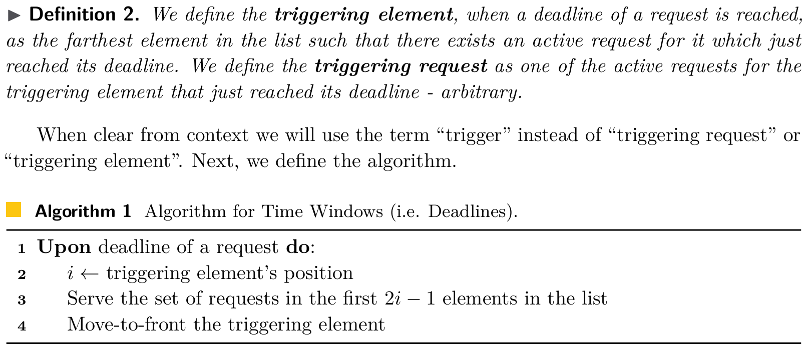

# List Update with Delays or Time Windows
[LIPIcs.ICALP.2024.15.pdf (dagstuhl.de)](https://drops.dagstuhl.de/storage/00lipics/lipics-vol297-icalp2024/LIPIcs.ICALP.2024.15/LIPIcs.ICALP.2024.15.pdf)

## List Update
- A list of elements
- Requests for these elements over time
- To fulfil these requests, we incur a cost of the number of their position in the list
- We can swap any two consecutive elements at a cost of $1$

### "Move to Front" algorithm
- Introduced by Sleator and Tarjan
- Immediately move any requested element to the front of the list
- Achieve a competitive ratio of 2
- [2786.2793 (acm.org)](https://dl.acm.org/doi/pdf/10.1145/2786.2793)

#### $2$ is the lower bound
- The adversary always requests the last element in the online algorithm’s list
- $ALG \ge nm$
- $OPT \le \frac{1}{2}n(n-1) + \frac{1}{2}m(n-1)$

### Random algorithm
- Upper Bound: 1.6 \
  Susanne Albers, Bernhard Von Stengel, and Ralph Werchner. A combined bit and timestamp algorithm for the list update problem. Information Processing Letters, 56(3):135–139, 1995.
- Lower Bound: 1.50084 \
  Christoph Ambühl, Bernd Gärtner, and Bernhard Von Stengel. A new lower bound for the list update problem in the partial cost model. Theoretical Computer Science, 268(1):3–16, 2001.

## List Update with Time Windows
- Each request arrives with a specific deadline by which it must be served, rather than being served immediately
- We can process multiple requests simultaneously, accessing the corresponding elements in a single pass
- The cost incurred in this case is determined by the position of the furthest element accessed

### A 24-competitive algorithm

## List Update with Delays
- The fixed deadlines are replaced with arbitrary delay functions
- The cost includes not only the access and swapping costs, but also penalties for the delays incurred until the requests are served

### A 336-competitive algorithm

## Open Problems
- Currently, the best lower bound for both problems considered is 2.
- Clairvoyance may improve the upper bound.
- Randomization.
